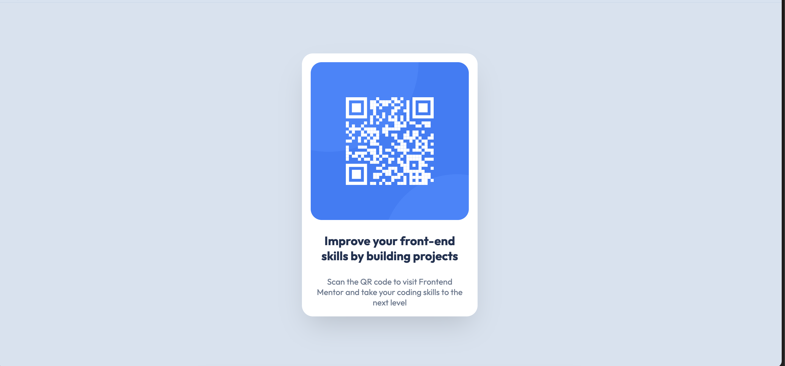

# Frontend Mentor - QR code component solution

This is a solution to the [QR code component challenge on Frontend Mentor](https://www.frontendmentor.io/challenges/qr-code-component-iux_sIO_H). Frontend Mentor challenges help you improve your coding skills by building realistic projects. 

## Table of contents

- [Overview](#overview)
  - [Screenshot](#screenshot)
  - [Links](#links)
- [My process](#my-process)
  - [Built with](#built-with)
  - [What I learned](#what-i-learned)
  - [Continued development](#continued-development)
  - [Useful resources](#useful-resources)
- [Author](#author)
- [Acknowledgments](#acknowledgments)

## Overview
In this challenge I built the QR code page by Frontend mentors. After long time i recreated a design from scratch using html css.

### Screenshot

### Links

- Solution URL: [Solution](https://www.frontendmentor.io/solutions/responsive-qr-code-component-using-flexbox-AwebMcKTOk)
- Live Site URL: [Live](https://harmonious-dragon-bb2d06.netlify.app/)

## My process
I started building the design with mobile first approach. I used flexbox to align the elements as per the design layout. I used css variables to avoid repeating the styles.

### Built with

- Semantic HTML5 markup
- CSS custom properties
- Flexbox
- Mobile-first workflow

### What I learned

I learnt how to center the main element using flexbox on screen and learned how to use universal selectors.

### Continued development

I want to dive more deeper into the media queries and design principles like typography, spacing and colors.

## Author

- Frontend Mentor - [@sagarpb1201](https://www.frontendmentor.io/profile/sagarpb1201)
- Twitter - [@sagarpb1201](https://www.twitter.com/sagarpb1201)
